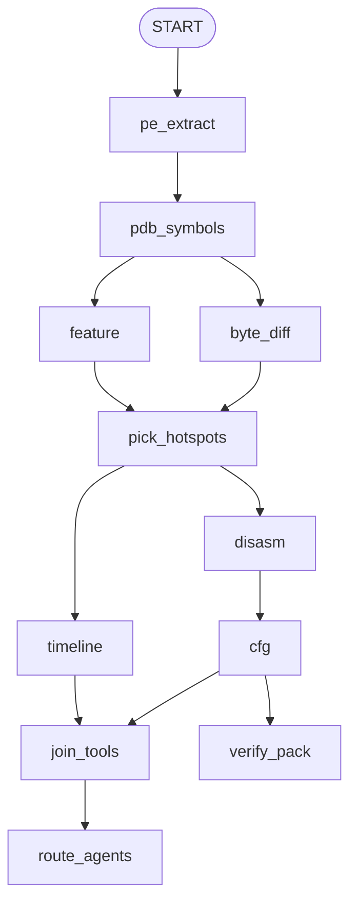

# Patchalyzer.ai

Windows 内核补丁对照与单文件审计平台。对齐漏洞版 / 修复版二进制，用确定性工具取证，再用固定人设的 LLM 专家写出可核对的中文报告。

服务对象是补丁负责人、防御方与安全运营，**不是** exploit 开发。

仓库：<https://github.com/CnOxx1/Patchalyzer.ai>

---

## 它做什么

两条主流程：

| 入口 | 何时用 | 产出 |
|---|---|---|
| **补丁对照** `/analyze`、`/patch` | 有 CVE，或有漏洞版 + 修复版 | 19 节技术报告：根因、漏洞链、IOC、在野利用、绕过面、残留 |
| **内核审计** `/audit` | 只有一份 `.sys` / `.dll` / `.exe`，没有补丁对 | 5 节短报告：用户入口、处理函数打分、缺陷类嫌疑、隔离 VM 观察清单 |

共同点：

- 证据来自 PE / PDB / `.pdata` 尺寸 / 反汇编 / CFG / Feature xref，禁止编造 RVA 与函数名。
- 结论旁区分【已证实】与【推断】。
- 不生成 exploit、PoC、payload，也不给出可复制的 IOCTL 触发序列。审计结果是 **嫌疑 + 观察条件**。

---

## 快速开始

需要 **Python 3.10+**、**Node.js 18+**（构建前端）、能访问 Microsoft 符号服务器。PDB 解析还依赖仓库上级目录的 `analysis/parse_pdb.py`（见 [依赖说明](#pdb-解析依赖)）。

```bat
git clone https://github.com/CnOxx1/Patchalyzer.ai.git
cd Patchalyzer.ai

pip install -r requirements.txt

cd ui
npm install
npm run build
cd ..

python run.py
```

浏览器打开 **http://127.0.0.1:8765**。

首次启动会创建管理员账号（用户名默认 `admin`，密码由环境变量 `PATCHALYZER_ADMIN_PASSWORD` 决定，未设置则用源码里的默认值）。登录后立刻改密。

开发前端可另开终端：

```bat
cd ui
npm run dev
```

Vite 在 `http://127.0.0.1:5173`，`/api` 会代理到 `8765`。生产由 FastAPI 直接托管 `ui/dist`。

---

## 产品界面

公开站：

| 路径 | 说明 |
|---|---|
| `/` | 落地页 |
| `/blog` | 公开研究报告 |
| `/login` | 登录 |

登录后工作台：

| 路径 | 说明 |
|---|---|
| `/app` | 工作台：待处理、KEV、绕过面、当前运行 |
| `/analyze` | 上传样本或填 CVE，启动补丁对照 |
| `/audit` | 上传单个内核模块，启动内核审计 |
| `/patch` | Patch Tuesday 公告、按 CVE 排队分析、可选自动监控 |
| `/jobs`、`/jobs/:id` | 任务列表与详情 |
| `/settings` | LLM（OpenAI 兼容）、专家提示词、GEPA |
| `/publish` | 把任务报告发成博客 |
| `/users` | 账号管理（管理员） |
| `/account` | 当前用户 |

补丁对照任务详情按四组页签组织：结论（决策 / 漏洞链）、检测（IOC / 在野 / 绕过面 / 残留）、完整报告、证据（流水线 / 对照 / 时间线 / 字节 / 符号 / 反汇编 / CFG / Feature / 验证包 / HuntLab）。

---

## 架构

```
浏览器  ui/（Vue 3 + Vue Router，构建产物 ui/dist）
    │  登录 cookie  ·  SSE / 轮询任务
    ▼
FastAPI  backend/main.py     python run.py → uvicorn reload=False
    │  分析在子进程跑，API 进程不占同一 GIL
    │  并发上限 PATCHALYZER_ANALYSIS_CONCURRENCY（默认 2）
    ▼
┌───────────────────────────┬────────────────────────────────┐
│ 补丁对照 kind=patch_diff  │ 内核审计 kind=kernel_audit      │
│ LangGraph 工具图 + 13 专家│ PE → PDB → 表面图 → 模式扫描    │
│                           │ → 每入口一个跟链 agent → 执笔   │
└───────────────────────────┴────────────────────────────────┘
    ▼
SQLite  data/patchalyzer.db   +   data/jobs/{id}/ 产物
```

| 层 | 路径 | 职责 |
|---|---|---|
| HTTP / 鉴权 | `backend/main.py`、`auth.py` | 任务、登录、博客、补丁日、HuntLab / 研究流程 |
| 图编排 | `backend/agents/graph.py` | 工具边、专家扇出、`finalize_soc` |
| 节点 | `backend/agents/nodes.py` | 每个 tool / 专家的输入输出 |
| 状态 | `backend/agents/state.py` | `PatchState` |
| LLM | `backend/agents/llm.py` | ChatOpenAI（OpenAI 兼容）；提示词来自设置或默认 |
| 确定性分析 | `backend/services/analyzer.py` | PE / PDB / `.pdata` / 反汇编 / CFG / Feature |
| 表面图 | `backend/services/surface.py` | IOCTL / FastIo / Immediate / MajorFunction |
| 缺陷类扫描 | `backend/services/lpe_patterns.py` | 缺 Probe、缺锁、生命周期、检查-使用窗口 |
| 内核审计 | `backend/services/kernel_audit.py` | 单文件流水线、入口 agent、断点续跑 |
| 工具箱 | `backend/services/agent_tools.py` | 白名单工具 + 有界 tool loop（流水线 / HuntLab / 审计共用） |
| 补丁解析 | `backend/services/patch_resolver.py` | CVE → MSRC + Winbindex 成对样本 |
| 补丁监控 | `backend/services/patch_watch.py` | 定时看新公告，可选自动排队 |
| IOC / 情报 / 评审 | `ioc.py`、`threat_intel.py`、`patch_review.py` | 覆盖报告 §16–§19 |
| HuntLab | `hunt_lab.py` | 图外深度狩猎（绕过面 + 变体） |
| 研究流程 | `research_lab.py` | 对照任务完成后的独立入口狩猎 |
| GEPA | `gepa_optimize.py` | 离线回放已完成任务优化提示词，不进在线流水线 |
| 前端 | `ui/src` | 工作台、对照、审计、补丁日、报告渲染（Markdown / Mermaid） |

分析子进程入口：`backend/services/analysis_worker.py`（`run_analysis_job` / `run_audit_job`）。

---

## 补丁对照流水线

### 怎么发起

1. **上传** `/analyze`：CVE 必填；漏洞样本可选。不传样本则按 CVE 从 MSRC KB + Winbindex 下载同分支「漏洞版 → 修复版」（优先 amd64）。可另传修复版、更早构建（三版本尺寸时间线）。
2. **补丁日** `/patch`：选某期公告里的 CVE，不上传文件。
3. **监控**：打开自动分析后，新补丁日最多再排队若干内核向 CVE（首次打开不会把当月全部倒进去）。

不能从 Update Catalog 解 MSU/CAB；文件名从 MSRC 标题推断（可手填）；Winbindex 可能落后于 Patch Tuesday。

### 工具阶段（确定性）

证据优先级：**`.pdata` 函数尺寸 > 反汇编 / 调用差 > Feature xref > 字节差**（字节差含 RIP 重定位噪声）。



| 节点 | 做什么 |
|---|---|
| `pe_extract` | 节区、导入、PDB 调试目录、FileVersion |
| `pdb_symbols` | Microsoft 符号服务器下 PDB，公开符号增删、`.pdata` 尺寸 |
| `feature` | Feature_* 开关与 xref |
| `byte_diff` | 代码节字节差 |
| `pick_hotspots` | 尺寸变化优先，辅以 Feature / 字节差 |
| `timeline` | 两版或三版尺寸时间线 |
| `disasm` | 热点 + 对照函数反汇编 |
| `cfg` | 控制流差，写出 `cfg_diff.html` |
| `verify_pack` | 隔离 VM 核对材料（服务器不跑 PoC） |
| `route_agents` | 按证据裁剪本轮专家（自动编制）或按勾选全跑（手动） |

未勾选 LLM 或未配 API Key：工具照跑，专家节点写「跳过」，图不中断。

### 13 个专家

人设固定，自动编制只决定「本轮跑哪些」，不发明新人格。

| Agent | 职责 |
|---|---|
| PEAnalyst | 版本 / 架构归因，跨大版本警告 |
| SymbolAnalyst | 热点函数、Feature 符号 |
| DisasmAnalyst | 锁 / 释放 / Probe / 拷贝 |
| FeatureAnalyst | Feature 启用位与 xref |
| ControlPathAnalyst | 排除未改对照路径 |
| RootCauseAnalyst | 综合根因 |
| DetectionAnalyst | IOC / 检测要点 |
| ThreatIntelAnalyst | 在野利用（检索 + KEV / NVD / EPSS） |
| BypassAnalyst | 补丁完整性：门控关闭、未改调用点、检查-使用窗口 |
| FeatureOffAnalyst | Feature 关闭是否回到旧链 |
| ResidualVulnAnalyst | 未改兄弟函数上的同类缺陷 |
| AliasSiteAnalyst | 补丁只打在部分 CALL 点 |
| ReportWriter | 按 19 节模板执笔 |

HuntPrep 是确定性节点：补未改兄弟反汇编，并用调用克隆 / CFG 缺口扩候选，再扇出 Bypass / Residual / Alias / FeatureOff。

### 19 节报告

编号与标题不可改、不可合并：

1. 执行摘要  
2. 分析方法论  
3. CVE/MSRC 描述对照  
4. 漏洞根因  
5. 竞态/同步时序  
6. 漏洞链（总览表 + 函数逻辑图 + 原语 + 补丁切断点）  
7. 汇编证据  
8. 伪代码对比  
9. 状态机/标志位  
10. Feature 开关  
11. 用户态触发面  
12. 利用难度与影响  
13. 对照路径排除  
14. 修复有效性与残余风险  
15. 附录  
16. IOC / 检测方法  
17. 在野利用 / 威胁情报  
18. 补丁完整性 / 绕过面  
19. 残留漏洞 / 同类缺陷  

§16–§19 的表由系统用 IOC / 情报 / Bypass / Residual 包注入，执笔人只写要点。任务完成后可单独开 **HuntLab**（深度狩猎）或 **研究流程**，报告写入 `hunt_lab.md` / `research.md`，不并进 19 节正文。

失败或未写完的任务可 **从断点继续**（按节点 checkpoint）。也可「重跑热点尾部」或「只重跑报告」（不再下 PDB / 反汇编）。

---

## 内核审计流水线

面向「手头只有一份驱动」：没有 patched_pattern，不对照修复版。

```
上传 .sys
    → PE + PDB
    → 表面图：DeviceControl / Immediate 表 / FastIo / MajorFunction
    → 绝对模式扫描（缺 Probe、缺锁、生命周期、检查-使用窗口）
    → 每个用户可达 API 一个 agent，沿 CALL 链跟到本模块子函数或其它 .sys/.dll
    → 执笔 5 节中文短报告
```

入口选择（最多 32 个 agent）：

- METHOD_NEITHER / Direct IOCTL 的独立处理函数
- Immediate 表已填槽
- FastIo 数据路径 callee
- high / medium 的 MajorFunction

共享 trampoline（如 `DispatchDeviceControl`、`ImmediateCallDispatch`）会折叠到表目标，避免几十个重复 dispatcher agent。已加固 / wrapper 入口用短预算（5 轮 / 12 次工具），其余用满预算（14 轮 / 32 次）。

每个 agent 必须把 `unresolved` 清空才能 `done`：本模块继续 `disasm`，跨模块 `list_imports` → `load_module` → `disasm(name, module=...)`。预算耗尽时剩余跳写入 `blocked`（`budget_exhausted`）。

额度不足（如 LLM 402）会 **停掉后续入口**，已完成的写入 `path_agents.json`。任务仍标完成，但带 `error`；页面可 **从断点继续**，只重跑未完成入口，并增量刷新 `kernel_audit.json`。

5 节报告：

1. 结论  
2. 用户入口（IOCTL / FastIo / MajorFunction）  
3. 处理函数打分  
4. 缺陷类证据  
5. 隔离 VM 观察清单  

关闭 LLM 时只跑确定性扫描与打分，仍可下载 JSON。

---

## 白名单分析工具

流水线专家、HuntLab、内核审计共用同一工具箱，无 shell、无任意代码执行。未知工具名会被拒绝。

`pe_info` · `list_symbols` · `function_meta` · `disasm` · `cfg_blocks` · `call_neighbors` · `xrefs` · `patched_pattern` · `feature_info` · `read_evidence` · `compare_calls` · `ioctl_table` · `handler_score` · `list_imports` · `load_module`

`disasm` 返回兴趣指令与函数头尾，不是全文。跨模块必须先 `load_module`。

---

## LLM 配置

在 **设置** 页填写 OpenAI 兼容接口。API Key 存在本地 SQLite（`data/patchalyzer.db`），不进 git。

| 提供商 | Base URL | Model 示例 |
|---|---|---|
| OpenAI | `https://api.openai.com/v1` | `gpt-4o-mini` |
| DeepSeek | `https://api.deepseek.com/v1` | `deepseek-chat` |
| Ollama | `http://127.0.0.1:11434/v1` | `llama3.2` |

可按专家改 system prompt。GEPA 在设置页对已完成任务离线回放，优化提示词，不进入分析图。

---

## 目录结构

```
（本仓库根 = 原工作区 webapp/）
  run.py                      uvicorn 入口
  requirements.txt
  README.md
  backend/
    main.py                   FastAPI
    config.py                 路径、19 节模板、专家 prompt、环境变量
    database.py               SQLite：jobs / llm_config / users / blog
    auth.py
    agents/                   LangGraph
    services/                 分析、审计、补丁日、情报
    tests/                    unittest
  ui/                         Vue 3 前端（npm run build → ui/dist）
  docs/                       流程与架构长文（部分仍写旧 frontend/ 路径，以本 README 为准）
  data/                       运行时（gitignore）
    patchalyzer.db
    pdb_cache/
    cache/msrc/
    jobs/{job_id}/
```

单次补丁对照任务目录常见产物：`old_vulnerable.sys` / `new_patched.sys`、`symbol_diff.json`、`feature_trace.json`、`byte_diff.json`、`disasm/`、`cfg_diff.html`、`hotspots.json`、`hunt_brief.json`、`checkpoints/`、`report.md`、`ioc.json`、`verify/`。

单次内核审计：`sample_*.sys`、`kernel_audit.json`、`path_agents.json`、`audit.md`。

---

## PDB 解析依赖

`backend/config.py` 从 **本仓库的上一级目录** 读取：

- `../analysis/parse_pdb.py` — PDB 7 公开符号与过程尺寸（必需）
- `../TOOLs/` — 历史路径；pefile / capstone 已由 `requirements.txt` 安装

从 GitHub 单独克隆本仓库时，请把 `parse_pdb.py` 放到与克隆目录同级的 `analysis/` 下：

```
somewhere/
  analysis/parse_pdb.py
  Patchalyzer.ai/          ← 本仓库
    run.py
    backend/
```

没有该文件则无法解析 PDB，符号差与函数尺寸会失败。

---

## 环境变量

| 变量 | 默认 | 说明 |
|---|---|---|
| `PATCHALYZER_HOST` | `127.0.0.1` | 监听地址 |
| `PATCHALYZER_PORT` | `8765` | 端口 |
| `PATCHALYZER_MAX_UPLOAD_MB` | `200` | 单文件上传上限 |
| `PATCHALYZER_ANALYSIS_CONCURRENCY` | `2` | 同时跑的分析子进程数（1–8） |
| `PATCHALYZER_ADMIN_USER` | `admin` | 空库时创建的管理员用户名 |
| `PATCHALYZER_ADMIN_PASSWORD` | （源码默认） | 空库时管理员密码；部署务必覆盖 |
| `PATCHALYZER_SESSION_DAYS` | `7` | 登录 cookie 有效期 |

---

## API 概览

除公开博客与登录外，接口需要会话 cookie。

| Method | Path | 说明 |
|---|---|---|
| GET | `/api/health` | 健康检查 |
| POST | `/api/auth/login` | 登录 |
| POST | `/api/auth/logout` | 退出 |
| GET | `/api/auth/me` | 当前用户 |
| GET/PUT | `/api/config/llm` | LLM 配置 |
| POST | `/api/config/llm/test` | 测连通 |
| POST | `/api/jobs` | 创建补丁对照（multipart） |
| POST | `/api/jobs/audit` | 创建内核审计（multipart，字段 `sample`） |
| POST | `/api/jobs/from-cve` | 从补丁日 CVE 排队 |
| GET | `/api/jobs` | 任务列表 |
| GET | `/api/jobs/events` | SSE 进度 |
| GET | `/api/jobs/{id}` | 详情 |
| POST | `/api/jobs/{id}/cancel` | 取消 |
| POST | `/api/jobs/{id}/resume` | 从断点继续（对照 checkpoint / 审计 path_agents） |
| POST | `/api/jobs/{id}/report` | 只重跑 LLM 报告 |
| POST | `/api/jobs/{id}/hotspots` | 加选热点并重跑尾部 |
| GET | `/api/jobs/{id}/report.md` | 下载 19 节报告 |
| GET | `/api/jobs/{id}/audit.json` | 审计 JSON |
| GET | `/api/jobs/{id}/audit.md` | 审计 Markdown |
| GET | `/api/jobs/{id}/ioc.json` 等 | IOC / 情报 / bypass / residual / CFG / verify.zip |
| POST | `/api/jobs/{id}/hunt-lab` | 启动 HuntLab |
| POST | `/api/jobs/{id}/research` | 启动研究流程 |
| GET/POST | `/api/patch-tuesday` | 补丁日目录 |
| GET/PUT | `/api/config/watch` | 监控开关 |

---

## 测试

在仓库根目录：

```bat
python -m unittest discover -s backend/tests -v
```

覆盖内核审计入口拆分、预算耗尽、额度错误停跑、模块解析与 LPE 模式扫描。

---

## 硬约束

- 不在 UI、提示词、Bypass / HuntLab / 审计 agent 中给出 exploit、PoC 或逐步绕过配方。
- RVA、指令、Feature ID、哈希必须来自工具证据。
- 专家目录固定 13 人；GEPA 只离线跑。
- 审计 findings 的 `status` 为 suspect / similar / cleared，需人工在隔离环境核对。

仅用于授权安全研究。

---

## 更多文档

`docs/` 里有更长的流程说明。其中部分章节仍按早期静态 `frontend/` 与专家人数撰写，**以本 README 与当前源码为准**。
