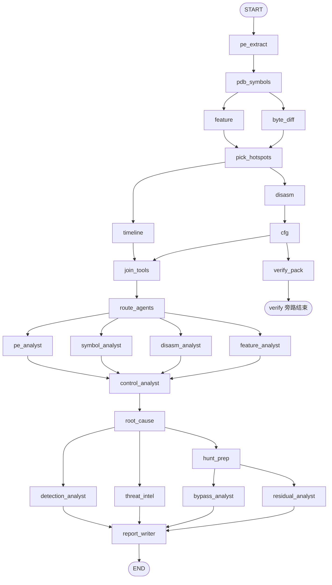

# Patchalyzer 技术文档

对照当前实现（`webapp/`，2026-08-24）。图结构以 `backend/agents/graph.py` 为准；节点以 `backend/agents/nodes.py` 为准；调度规则以 `backend/services/pipeline.py` 的 `route_agents` 为准。

---

## 1. 产品定位

Patchalyzer 对比 **漏洞版 / 修复版** Windows 内核驱动（`.sys` / `.dll` / `.exe`），用确定性工具采集证据，再用一组固定人设的 LLM 专家解读，产出 **19 节中文技术报告**。

服务对象是补丁负责人、防御方与安全运营，**不是** exploit 开发。

硬约束：

- 不在 UI、提示词、BypassAnalyst 中给出 exploit / PoC / 逐步绕过配方。
- RVA、指令、Feature ID、哈希必须来自工具证据，禁止编造。
- 专家目录固定为 **11 人**，动态调度只决定「本轮跑哪些、跳过原因」，不发明新人格。
- GEPA 提示词优化在分析图外离线运行，不进在线流水线。

默认入口：`python run.py` → `http://127.0.0.1:8765`（`PATCHALYZER_HOST` / `PATCHALYZER_PORT`，`reload=False`）。

---

## 2. 系统分层

```
浏览器  frontend/
    │  POST /api/jobs
    │  GET  /api/jobs/{id}  轮询
    ▼
FastAPI  backend/main.py
    │  后台 _run_job
    │  可选：CVE → 自动拉修复版
    ▼
LangGraph  backend/agents/graph.py
    ├─ 工具阶段（确定性，可并行）
    ├─ route_agents（纯规则编制）
    └─ 11 个 LLM 专家（图结构固定，节点内可跳过）
    ▼
finalize_soc()  注入 IOC / 情报 / 绕过面 / 残留包
    ▼
SQLite 任务行 + data/jobs/{job_id}/ 产物
```

| 层 | 路径 | 职责 |
|---|---|---|
| HTTP / 任务 | `backend/main.py` | 上传、跑图、取消/断点、下载、重跑热点/报告 |
| 图编排 | `backend/agents/graph.py` | 边、流式进度、产物打包、`finalize_soc` |
| 节点 | `backend/agents/nodes.py` | 每个 tool / agent 的输入输出 |
| 状态 | `backend/agents/state.py` | `PatchState`；`traces` 用 `operator.add` 拼接 |
| LLM | `backend/agents/llm.py` | ChatOpenAI；提示词来自设置或 `config.py` |
| 调度 / 热点 | `backend/services/pipeline.py` | `route_agents`、`plan_hotspots`、`assess_quality`、checkpoint |
| 确定性分析 | `backend/services/analyzer.py` | PE / PDB / `.pdata` / 反汇编 / CFG / Feature |
| 补丁解析 | `backend/services/patch_resolver.py` | 只上传漏洞版 + CVE 时拉修复构建 |
| IOC | `backend/services/ioc.py` | 哈希、hunt 结构；覆盖报告 §16 |
| 威胁情报 | `backend/services/threat_intel.py` | 联网检索 + KEV / NVD / EPSS；覆盖 §17 |
| 补丁评审 | `backend/services/patch_review.py` | Bypass / Residual JSON 包；覆盖 §18 / §19 |
| 函数逻辑图 | `backend/services/func_logic.py` | 从热点与调用差生成 mermaid，注入报告 |
| GEPA | `backend/services/gepa_optimize.py` | 离线回放已完成任务优化提示词 |
| 配置 | `backend/config.py` | 19 节模板、11 份专家 system prompt |
| 前端 | `frontend/js/app.js` | 编制开关、流水线、页签、Markdown |

---

## 3. 目录与运行时数据

```
webapp/
  run.py                      # uvicorn，reload=False
  requirements.txt
  backend/
    main.py                   # FastAPI
    config.py
    database.py               # SQLite：jobs + llm_config
    agents/
      graph.py
      nodes.py
      state.py
      llm.py
    services/
      pipeline.py
      analyzer.py
      patch_resolver.py
      ioc.py / threat_intel.py / patch_review.py
      func_logic.py
      gepa_optimize.py
  frontend/                   # 静态页
  data/
    patchalyzer.db
    pdb_cache/                # 按 PDB GUID 缓存
    jobs/{job_id}/            # 单次任务工作目录
  docs/
```

分析核心复用仓库根目录 `analysis/`（PDB 解析）与 `TOOLs/`（pefile / capstone）。

环境变量：

| 变量 | 默认 | 说明 |
|---|---|---|
| `PATCHALYZER_HOST` | `127.0.0.1` | 监听地址 |
| `PATCHALYZER_PORT` | `8765` | 端口 |
| `PATCHALYZER_MAX_UPLOAD_MB` | `200` | 单文件上限 |

LLM 配置（provider / base_url / api_key / model / 各专家 prompt）存在 SQLite `llm_config`，不进 git。

---

## 4. 任务生命周期

### 4.1 创建

`POST /api/jobs`（multipart）：

| 字段 | 必填 | 说明 |
|---|---|---|
| `old_file` | 是 | 漏洞版样本 |
| `new_file` | 否 | 修复版；不传则必须有 `cve` |
| `mid_file` | 否 | 更早构建，用于三版本尺寸时间线 |
| `cve` / `title` | 标题可空 | 空标题时用 CVE 或「未命名分析」 |
| `run_llm` | 默认 true | false 时只跑工具，专家全部跳过 |
| `enabled_agents` | 否 | 逗号分隔的专家 ID；勾选上限 |
| `agents_set` | 否 | `1` 表示客户端显式提交了勾选（空串 = 全不选） |
| `routing_mode` | 默认 `auto` | `auto` 自动编制 / `manual` 按勾选全跑 |
| `old_label` / `new_label` / `mid_label` | 否 | 报告与时间线列名 |

校验：没有修复版且没有 CVE → HTTP 400。样本写入 `data/jobs/{id}/`，SQLite 建行 `status=pending`，`routing_mode` 写入工作目录 `routing.json`，后台 `_run_job`。

勾选语义：

- `enabled_agents is None`：用户允许全部 11 人（未显式提交勾选）。
- `enabled_agents == []`：强制 `run_llm=False`。
- 非空列表：自动编制的上限；未勾选的永不跑。

### 4.2 运行

`_run_job`：

1. `status=running`，进度写入内存 `JOB_PROGRESS`。
2. **若未上传修复版**：`resolve_patched_binary`  
   读漏洞版 FileVersion / 架构 / 原文件名 → MSRC KB → Winbindex 同分支更高版本下载。失败抛 `PatchResolveError`。成功写 `resolve.json`。
3. `invoke_analysis_graph(..., routing_mode=load_routing_mode(work))`。
4. 成功：`status=completed`，`result.artifacts` 入库。失败 / 取消分别记 `failed` / `cancelled`。

前端轮询 `GET /api/jobs/{id}`。百分比来自 `NODE_PCT` 与 traces。

### 4.3 其它入口

| 入口 | 图 | 说明 |
|---|---|---|
| `POST .../resume` | `build_graph`，`resume=True` | 失败/取消后从 per-node checkpoint 续跑 |
| `POST .../retry-pdb` | 同上，`force_nodes` 从 PDB 起 | 符号失败后重下 PDB 并重跑后续 |
| `POST .../hotspots` | `build_tail_graph` | 加选函数名，重跑热点尾部 + 再编制 |
| `POST .../report` | `build_llm_graph` | 只重跑专家；工具产物复用 |
| `POST .../cancel` | — | 协作式取消，下一节点 `check_cancel` 抛 `PipelineCancelled` |

旧任务缺少 `routing_mode` / `evidence_quality` / `conclusions` 仍可打开；这些字段要新跑一轮才会出现。

---

## 5. LangGraph 主图

图结构对所有任务相同。专家是否真正调 LLM，由节点内三道闸决定，**不按任务重建图**。



设计意图：

| 决策 | 原因 |
|---|---|
| PE → PDB 串行 | 下 PDB 需要 PE 调试目录里的 GUID |
| Feature ∥ 字节差 → 再选热点 | 热点必须能强制纳入 Feature xref |
| 时间线 ∥ 反汇编 → CFG | CFG 依赖反汇编；时间线不阻塞反汇编 |
| `verify_pack` 不挡专家 | 验证包生成与 LLM 解读并行；失败不影响报告 |
| `route_agents` 在 `join_tools` 之后 | 编制只看工具证据，不看专家草稿 |
| 四专家并行再汇入对照路径 | PE / 符号 / 反汇编 / Feature 互不依赖 |
| 根因后 HuntPrep 独立流水线 | Bypass / Residual 先吃未改兄弟函数反汇编，再并行狩猎新漏洞 |
| 检测 / 情报与狩猎并行 | SOC 两路不阻塞完整性/残留发现 |
| 报告最后写 | 必须吃到 IOC / 情报 / 绕过 / 残留包 |

进度锚点（`NODE_PCT`）：PE 8 → PDB 24 → Feature/字节差 32 → 热点 36 → 时间线 44 → 反汇编 56 → CFG 61 → 验证包 63 → 汇合 64 → 编制 65 → 四专家 68–76 → 对照 80 → 根因 86 → HuntPrep/检测/情报 90 → Bypass/Residual 92 → 报告 97。

---

## 6. 工具阶段（确定性）

全局证据优先级（写入默认 system prompt，也约束热点规划）：

**`.pdata` 函数尺寸 > 反汇编 / 调用差 > Feature xref > 字节差（含 RIP 重定位噪声）**

### 6.1 节点一览

| 图节点 | 轨迹名 | 做什么 |
|---|---|---|
| `pe_extract` | PEExtractor | 并行抽 old/new/mid：节区、导入、FileVersion、机器类型、时间戳、哈希、PDB GUID |
| `pdb_symbols` | SymbolDiffer | 按 GUID 命中 `data/pdb_cache` 或从 Microsoft 符号服务器拉取；`compare_symbols`；失败则导出表/.pdata 启发式降级 |
| `feature` | FeatureTracer | 在修复版里追 `Feature_*` 符号 xref |
| `byte_diff` | ByteDiffer | 代码节字节差（辅证，降权） |
| `pick_hotspots` | HotspotPicker | `plan_hotspots` + `assess_quality` |
| `timeline` | SizeTimeline | 2 或 3 个构建的函数尺寸时间线 |
| `disasm` | DisasmWorker | Capstone 反汇编热点；对照函数另出一份 |
| `cfg` | CfgDiffer | 基本块/边 diff，写 `cfg_diff.html` |
| `verify_pack` | VerifyPack | 生成 Verifier / WinDbg 验证包（服务器不执行） |
| `join_tools` | JoinTools | 汇合屏障，无计算 |
| `route_agents` | AgentRouter | 纯规则编制，写 `routing.json` |

工具节点 **不可被编制跳过**。PDB 失败不中断图：质量标为 `unreliable`，UI 提示可「重试 PDB」。

### 6.2 热点规划 `plan_hotspots`

顺序填槽（默认最多 16 个热点、8 个强制 Feature、12 个进 CFG）：

1. Feature xref 强制纳入  
2. 用户加选（`extra_hotspots.json`）  
3. `|Δsize|` 最大的 `.pdata` 变化函数  
4. 字节差 top（排除带 `+` 的重定位噪声标签）

产出 `hotspot_plan`：`selected`、`reasons`、`feature_forced`、`uncovered_resized`、`uncovered_feature` 等。未覆盖清单可在完成后加选，走 `invoke_hotspot_rerun`。

### 6.3 证据质量 `assess_quality`

| `level` | 标签 | 触发 |
|---|---|---|
| `ok` | 证据充足 | PDB 可用且热点覆盖完整 |
| `partial` | 热点未覆盖完整 | 有尺寸变化或 Feature xref 没进反汇编 |
| `unreliable` | 结论不可靠 | PDB 缺失或符号为启发式 |

`partial` / `unreliable` 会让自动编制打开 Bypass / Residual 深挖。

### 6.4 喂给模型的切片

`function_slices` 按函数裁剪反汇编（过滤无关指令窗口），避免把整份字节差塞进上下文。字节差只作 brief。

---

## 7. 动态 Agent 调度

### 7.1 原则

- 目录仍是下面 11 个 ID，前后端、提示词、轨迹名必须一致。  
- 动态 = **子集 +（预留）深度**，在工具之后用规则决定。  
- **不用 LLM 当调度器**（避免额外调用、避免调度器自己产生人格）。  
- **不按任务重建 LangGraph**。跳过发生在 `_safe_agent` 内部。

### 7.2 三道闸 `agent_enabled`

```
run_llm  ∩  用户勾选上限  ∩  routed_agents
```

| 参数 | `None` 的含义 |
|---|---|
| `enabled_agents` | 用户允许全目录 |
| `routed_agents` | 不裁剪（手动编制） |

手动编制：`routed_agents = None`，只受勾选约束。  
自动编制且 `run_llm=False`：`routed_agents = []`，11 人全部跳过并写原因「未启用 LLM」。

### 7.3 自动编制规则

**核心（有勾选就跑）**

`PEAnalyst`、`SymbolAnalyst`、`DisasmAnalyst`、`RootCauseAnalyst`

**报告岗（LLM 开着就跑）**

`ReportWriter`、`DetectionAnalyst`

**证据岗**

| 专家 | 跑 | 跳过原因 |
|---|---|---|
| `FeatureAnalyst` | Feature xref / `Feature_*` 符号 / 热点名含 `Feature_` | 无 Feature xref / Feature_* 符号 |
| `ControlPathAnalyst` | 有对照函数名或对照反汇编 | 无对照函数 |

**运营岗**

| 专家 | 跑 | 跳过原因 |
|---|---|---|
| `ThreatIntelAnalyst` | 标题、`resolve.json` 或补丁元数据含 `CVE-YYYY-n` | 标题/元数据中无 CVE |
| `BypassAnalyst` / `ResidualVulnAnalyst` | 有第三样本，或热点未覆盖，或质量 `partial`/`unreliable` | 无第三样本且热点已覆盖 |

跳过轨迹形如 `跳过 FeatureAnalyst：无 Feature xref / Feature_* 符号`，前端节点状态识别「跳过」。

### 7.4 编制产物

`data/jobs/{id}/routing.json` 示例：

```json
{
  "routing_mode": "auto",
  "routed_agents": ["PEAnalyst", "SymbolAnalyst", "DisasmAnalyst", "RootCauseAnalyst", "ReportWriter", "DetectionAnalyst", "ThreatIntelAnalyst"],
  "skip_reasons": {
    "FeatureAnalyst": "无 Feature xref / Feature_* 符号",
    "ControlPathAnalyst": "无对照函数",
    "BypassAnalyst": "无第三样本且热点已覆盖，跳过绕过面深挖",
    "ResidualVulnAnalyst": "无第三样本且热点已覆盖，跳过残留深挖"
  },
  "prompt_depth": { "PEAnalyst": "full", "...": "full" },
  "routing_signals": {
    "has_feature": false,
    "has_control": false,
    "has_cve": true,
    "ops_depth": false,
    "run_llm": true
  }
}
```

`prompt_depth` 已写入状态，**当前提示词尚未按 brief/full 分流**（P1 预留）。

---

## 8. 十一名专家

图节点始终存在。未入编制时 `_safe_agent` 写「（跳过：原因）」并继续。已有非跳过笔记时（热点重跑）会「沿用已有」。单专家 LLM 失败记 `llm_error`，不中断全图。

| ID | 图节点 | 笔记字段 | 职责 |
|---|---|---|---|
| PEAnalyst | `pe_analyst` | `pe_notes` | 架构/版本/是否同分支 |
| SymbolAnalyst | `symbol_analyst` | `symbol_notes` | `.pdata` 热点、补丁落在哪一跳 |
| DisasmAnalyst | `disasm_analyst` | `disasm_notes` | 锁 / Feature 门控 / 池释放 |
| FeatureAnalyst | `feature_analyst` | `feature_notes` | Feature ID 与 xref |
| ControlPathAnalyst | `control_analyst` | `control_notes` | 对照未改路径，排除误报 |
| RootCauseAnalyst | `root_cause` | `root_cause` | 综合根因、一句话、切断点 |
| DetectionAnalyst | `detection_analyst` | `detection_notes` | 运营 hunt 要点；系统注入 IOC 表 |
| ThreatIntelAnalyst | `threat_intel` | `threat_notes` | 检索解读；组织名必须出现在摘录中 |
| BypassAnalyst | `bypass_analyst` | `bypass_notes` | 独立狩猎：不完整修复 / Feature 关闭路径 / 未改调用点 |
| FeatureOffAnalyst | `feature_off_analyst` | `feature_off_notes` | Feature 关闭是否回到旧逻辑；汇入 §18 |
| ResidualVulnAnalyst | `residual_analyst` | `residual_notes` | 独立狩猎：未改兄弟函数中的同类缺陷 |
| AliasSiteAnalyst | `alias_site_analyst` | `alias_notes` | 补丁是否只打在部分 CALL 点；汇入 §19 |
| HuntPrep（工具） | `hunt_prep` | `hunt_brief` | 调用图二轮反汇编 + 调用克隆 / CFG 缺口 / 检查-使用窗口 / 跨构建尺寸未变 |
| ReportWriter | `report_writer` | `report` | 按 19 节执笔 |

前端预设：

- 核心解读：PE / Symbol / Disasm / Feature / ControlPath / RootCause  
- 检测与报告：Detection / ThreatIntel / Bypass / Residual / ReportWriter  
- 只要报告：仅 ReportWriter  

Bypass / Residual 的 JSON 包由 `patch_review.py` 从笔记中抽出 `verdict` + `findings`，禁止把逐步利用写进包。

---

## 8.1 深度狩猎 HuntLab（与主流水线隔离）

主 LangGraph **不会**自动跑这一段。任务 `completed` 后，在结果页「深度狩猎」手动启动。

两条 Agent 线均可调用白名单工具（最多 8 轮 / 16 次调用），**不写入 §18 / §19**：

| 线 | 流程 | 产出 |
|---|---|---|
| 补丁绕过面 | 弄清新检查 → 用工具逐条验证 H1–H5（Feature 关闭、部分 CALL 点、CFG 缺口、失败返回、检查-使用窗口） | `hunt_lab.bypass` |
| 同类变体 | Windows patch-diffing：定位补丁 → 还原缺陷类 → 枚举兄弟/调用者 → 取样反汇编 | `hunt_lab.similar` |
| 执笔 | 五节独立报告 | `hunt_lab.report` / `hunt_lab.md` |

白名单工具：`list_symbols`、`function_meta`、`disasm`、`cfg_blocks`、`call_neighbors`、`patched_pattern`、`feature_info`、`read_evidence`、`compare_calls`。禁止 exploit / PoC。反汇编预算 10，CFG 预算 3。

API：`POST /api/jobs/{id}/hunt-lab`，`POST .../hunt-lab/cancel`，下载 `hunt-lab.json` / `hunt-lab.md`。

---

## 9. 报告与 SOC 收尾

ReportWriter 必须按 `DEFAULT_REPORT_STRUCTURE` 输出 **19** 个一级标题，编号与文字不可改。

| 节 | 内容 | 谁说了算 |
|---|---|---|
| 1 执行摘要 | 决策层：根因一句话、切断点 | 执笔 + `conclusions` |
| 2 方法论 | 样本、PDB、筛选规则 | 执笔 |
| 3 CVE/MSRC 对照 | 无 CVE 时改写威胁模型，标题仍保留 | 执笔 |
| 4 根因 | 缺陷机制，不写完整攻击链 | RootCause |
| 5 时序 | 有证据才画 sequenceDiagram | RootCause |
| 6 漏洞链 | 核心交付物：步骤表 + 函数逻辑图 | RootCause + `func_logic` |
| 7 汇编证据 | Top 变化函数 | Disasm |
| 8 伪代码对比 | 2 个核心函数 | Disasm |
| 9 状态机 | 无则一句结束 | 执笔 |
| 10 Feature | 无则写无新增 | Feature |
| 11 用户态触发面 | API/IOCTL ↔ §6 | 执笔 |
| 12 利用难度 | 概念层，无逐步 exploit | 执笔 |
| 13 对照路径 | 排除未改子系统 | ControlPath |
| 14 修复有效性 | 交叉引用 §18/§19 | 执笔 |
| 15 附录 | 尺寸表、产物路径、置信度 | 系统 |
| 16 IOC | 执笔写运营要点；表由系统覆盖 | Detection + `ioc.py` |
| 17 在野 | 执笔 2–4 句；表由系统注入 | ThreatIntel |
| 18 补丁完整性 | 一句话结论；表由系统注入 | Bypass |
| 19 残留 | 一句话结论；表由系统注入 | Residual |

`finalize_soc` 在图结束后：

1. 从报告/根因抽 `vuln_chain`  
2. 生成 `ioc_pack`（哈希必须来自 PE）  
3. 若编制仍包含 ThreatIntel 且包过期/CVE 不一致，再查一次 KEV/NVD/EPSS  
4. 补齐 bypass/residual pack  
5. `extract_conclusions`：根因一句话 + 补丁切断点  
6. `build_func_logic` mermaid  
7. 把 §16–19 与函数逻辑图 **覆盖进** `report.md`（避免执笔粘贴专家全文）

前端摘要页优先展示 `conclusions.root_one_liner` 与 `conclusions.patch_cut`。导出运营包默认节号 `[1, 12, 16, 17, 18, 19]`。

---

## 10. 断点、取消、重跑

`guarded(node_name, fn)`：

1. `check_cancel`  
2. 若 `resume` 且节点不在 `force_nodes` 且存在 `checkpoints/{node}.json` → 直接返回缓存  
3. 否则执行节点并写入 checkpoint（不含 traces）

取消是协作式的：UI `POST /cancel` 把 job id 放进内存集合，下一节点抛 `PipelineCancelled`。

热点重跑 `force_nodes` 含 `pick_hotspots` … `join_tools`、`route_agents`，以便加选函数后重新编制。  
PDB 重试从 `pdb_symbols` 强制到 `report_writer`（含 `route_agents`）。

---

## 11. HTTP API

前缀 `/api`。静态页 `GET /` 提供 `frontend/`。

| 方法 | 路径 | 说明 |
|---|---|---|
| GET | `/api/health` | 存活 |
| GET/PUT | `/api/config/llm` | LLM 配置（PUT 不回显完整 key） |
| GET | `/api/config/llm/defaults` | 默认 prompt / 19 节模板 |
| POST | `/api/config/llm/test` | 测连通 |
| POST | `/api/config/llm/gepa` | 离线 GEPA（不进分析图） |
| GET | `/api/jobs` | 最近任务 |
| POST | `/api/jobs` | 创建 |
| GET | `/api/jobs/{id}` | 详情 + artifacts + 进度 |
| POST | `/api/jobs/{id}/cancel` | 取消 |
| POST | `/api/jobs/{id}/resume` | 断点续跑 |
| POST | `/api/jobs/{id}/retry-pdb` | 重下 PDB |
| POST | `/api/jobs/{id}/hotspots` | 加选热点 |
| POST | `/api/jobs/{id}/report` | 只重跑 LLM |
| GET | `/api/jobs/{id}/report.md` | 下载报告 |
| GET | `/api/jobs/{id}/ioc.json` | IOC 包 |
| GET | `/api/jobs/{id}/threat.json` | 情报包（`?refresh=1` 可再查） |
| GET | `/api/jobs/{id}/bypass.json` | 绕过面包 |
| GET | `/api/jobs/{id}/residual.json` | 残留包 |
| GET | `/api/jobs/{id}/cfg_diff.html` / `cfg_diff.json` | CFG |
| GET | `/api/jobs/{id}/verify.zip` | 验证包 |

---

## 12. 前端

静态单页。关键交互：

- **自动编制 / 手动编制** 单选，默认自动，记在 `localStorage`（`patchalyzer.routing_mode`）。  
- 专家勾选记在 `patchalyzer.enabled_agents`。自动模式下提示：勾选是上限。  
- 流水线三列：证据采集、专家解读（含 AgentRouter）、综合输出。  
- 节点状态：完成 / 运行 / 跳过 / 失败 / 等待；跳过正则匹配「跳过」「未启用」。  
- 节点详情展示 `skip_reasons` 与最后一条 trace。  
- 页签分层：摘要、符号、时间线、反汇编、CFG、Feature、验证、IOC、情报、绕过、残留、报告。  
- 资源缓存参数：`?v=20260824c`（改前端后需递增）。

旧任务没有 `AgentRouter` 轨迹时该节点显示等待/空，不影响打开。

---

## 13. 工作目录产物

`data/jobs/{id}/` 典型文件：

| 文件 | 说明 |
|---|---|
| `old_*` / `new_*` / `mid_*` | 样本 |
| `resolve.json` | 自动匹配修复版的元数据 |
| `routing.json` | 编制计划 |
| `hotspot_plan.json` | 热点规划与质量 |
| `extra_hotspots.json` | 用户加选 |
| `checkpoints/{node}.json` | 节点断点 |
| `result.json` | 完整 artifacts |
| `report.md` | 19 节报告 |
| `ioc.json` / `threat_intel.json` / `bypass_review.json` / `residual_review.json` | SOC 包 |
| `func_logic.json` / `vuln_chain.json` | 函数逻辑图与漏洞链 |
| `cfg_diff.html` | CFG 可视化 |
| `disasm/` | 按函数反汇编文本 |
| `verify/` | 验证包源文件 |
| `pdb/` | 本次任务 PDB 副本 |

PDB 全局缓存：`data/pdb_cache/`，键为 PE 调试目录 GUID。

SQLite `jobs` 行保存 `status`、`agents_json`（勾选上限）、`result_json`。`routing_mode` 以工作目录文件为准，不另开列，以便旧库兼容。

---

## 14. LLM 与 GEPA

- 协议：OpenAI 兼容 Chat Completions（`langchain_openai.ChatOpenAI`）。  
- 默认模型 `gpt-4o-mini`，`temperature=0.15`，`max_tokens=16384`，超时 300s。  
- 每个专家一份可在设置页覆盖的 system prompt；ReportWriter 额外附 19 节结构。  
- `GEPA`：`POST /api/config/llm/gepa` 用已完成任务回放打分、改 prompt，**不**在分析图里插入优化节点。

---

## 15. 关键设计决策

1. **先工具后专家**：编制信号全部来自确定性产物，避免调度器幻觉。  
2. **图固定、节点内跳过**：LangGraph 并行边简单；重建图无法利用 checkpoint。  
3. **勾选是上限不是下限**：自动编制 ⊆ 勾选，防止「全选默认」时无证据专家仍烧 token。  
4. **Verify 不挡报告**：验证包给人工 WinDbg 用，与 LLM 解耦。  
5. **§16–19 由系统覆盖**：执笔只写要点，表来自结构化包，减少编造哈希/组织名。  
6. **PDB 可降级可重试**：没有符号也能出启发式报告，但质量打 `unreliable`。

尚未落地（有字段预留）：

- P1：`prompt_depth` 为 `brief|full`，缩短被降权专家的上下文。  
- P2：根因过薄时，额外一跳「反汇编 → 根因」重跑。

---

## 16. 依赖

见 `requirements.txt`：FastAPI / Uvicorn / httpx / pefile / capstone / LangGraph / LangChain OpenAI / gepa。PDB 解析走仓库内 `analysis` 脚本，不经 pip。

启动后健康检查：`GET http://127.0.0.1:8765/api/health`。
