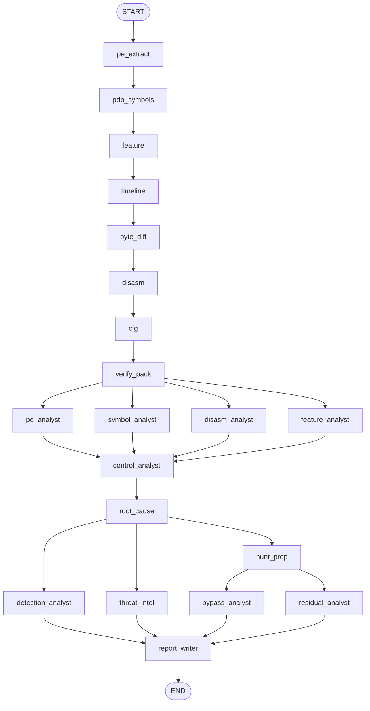

# Patchalyzer.ai 逻辑流程

本文对照当前实现（`webapp/`）描述一次分析从上传到报告的完整路径。图结构以 `backend/agents/graph.py` 为准；节点职责以 `backend/agents/nodes.py` 为准。

**产品定位**：对比「漏洞版 / 修复版」Windows 驱动（`.sys` / `.dll` / `.exe`），用确定性工具采集证据，再用一组 LLM 专家解读，产出 19 节中文技术报告。服务对象是补丁负责人、防御方与安全运营，**不是** exploit 开发。

**默认入口**：`python run.py` → `http://127.0.0.1:8765`（`PATCHALYZER_HOST` / `PATCHALYZER_PORT`，`reload=False`）。前端静态页在 `webapp/frontend/`。

---

## 1. 系统分层

```
浏览器 (frontend/)
    │  POST /api/jobs  上传样本
    │  GET  /api/jobs/{id}  轮询进度
    ▼
FastAPI (backend/main.py)
    │  后台任务 _run_job
    │  可选：CVE → 自动下载修复版 (patch_resolver)
    ▼
LangGraph (backend/agents/graph.py)
    ├─ 工具阶段（8 节点，串行，确定性）
    └─ LLM 阶段（11 个专家，有并行汇合）
    ▼
finalize_soc()  补齐 IOC / 情报 / 绕过面 / 残留漏洞包，写磁盘
    ▼
SQLite 任务记录 + data/jobs/{job_id}/ 产物
```

| 层 | 关键文件 | 做什么 |
|---|---|---|
| HTTP / 任务 | `backend/main.py` | 上传、后台跑图、下载报告/IOC、重跑 LLM、GEPA |
| 图编排 | `backend/agents/graph.py` | 节点边、流式进度、产物打包 |
| 节点 | `backend/agents/nodes.py` | 每个 tool / agent 的输入输出 |
| 状态 | `backend/agents/state.py` | `PatchState`；`traces` 用 `operator.add` 拼接 |
| LLM 客户端 | `backend/agents/llm.py` | ChatOpenAI；提示词来自设置或 `config.py` 默认 |
| 确定性分析 | `backend/services/analyzer.py` | PE / PDB / `.pdata` 尺寸 / 反汇编 / CFG / Feature |
| 补丁解析 | `backend/services/patch_resolver.py` | 只上传漏洞版 + CVE 时，MSRC + Winbindex 拉修复构建 |
| IOC | `backend/services/ioc.py` | 哈希 / 版本 / hunt 结构；强制写入报告 §16 |
| 威胁情报 | `backend/services/threat_intel.py` + `web_search.py` | 联网检索 + KEV / NVD / EPSS |
| 补丁评审 | `backend/services/patch_review.py` | 从 Bypass/Residual 笔记解析 JSON 包，写入 §18 / §19 |
| GEPA | `backend/services/gepa_optimize.py` | **不在分析图内**；离线回放已完成任务优化提示词 |
| 配置 | `backend/config.py` | 默认 19 节模板、各专家 system prompt |
| 前端 | `frontend/js/app.js` | 流水线可视化、页签、Markdown 渲染 |

---

## 2. 任务生命周期

### 2.1 创建

`POST /api/jobs`（multipart）：

| 字段 | 必填 | 说明 |
|---|---|---|
| `old_file` | 是 | 漏洞版样本 |
| `new_file` | 否 | 修复版；不传则必须有 `cve` |
| `mid_file` | 否 | 更早构建，用于三版本尺寸时间线 |
| `cve` / `title` | 标题可空 | 空标题时用 CVE 或「未命名分析」 |
| `run_llm` | 默认 true | false 时只跑工具节点，专家写「跳过」 |
| `old_label` / `new_label` / `mid_label` | 否 | 报告与时间线列名 |

校验：没有修复版且没有 CVE → HTTP 400。样本写入 `data/jobs/{job_id}/`，SQLite 建任务，`status=pending`，后台 `_run_job`。

### 2.2 运行

`_run_job`：

1. `status=running`，进度写入内存 `JOB_PROGRESS`。
2. **若未上传修复版**：`resolve_patched_binary(old, cve)`  
   - 读漏洞版 `FileVersion` / 架构 / `original_filename`  
   - 查 MSRC 得到 KB 集合  
   - 在 Winbindex 同分支、更高版本、匹配 KB 的条目中下载  
   - 失败（已是修复构建、无 KB、无同分支命中）抛 `PatchResolveError`  
   - 成功则写 `resolve.json`，并记入 `artifacts.patch_resolve`
3. `invoke_analysis_graph(...)` 跑完整 LangGraph。
4. 成功：`status=completed`，`result.artifacts` 入库。失败：`status=failed`，`error` 为异常文本。

前端轮询 `GET /api/jobs/{id}`。进度百分比来自各节点 `traces[].percent`。

### 2.3 仅重跑 LLM

`POST /api/jobs/{id}/report`：任务必须已 `completed` 且已有工具产物。走 `invoke_llm_phase`（`build_llm_graph`），**不再**提取 PE / 下 PDB / 反汇编。用于改提示词或换模型后重写报告。

---

## 3. 主图：工具 → 专家 → 报告

LangGraph 边（`build_graph`）如下。工具阶段全部串行；专家阶段有两处扇出汇合。



设计意图：

- **Feature 提前于反汇编 / CFG**：热点选择要把 Feature xref 算进去。
- **四专家并行**：PE / 符号 / 反汇编 / Feature 互不依赖。
- **对照路径在并行之后**：排除「未改函数」需要四份笔记齐。
- **根因后独立狩猎流水线**：HuntPrep 补未改兄弟函数反汇编，并用调用克隆 / CFG 缺口 / 检查-使用窗口扩候选，再并行跑 Bypass / Residual / Alias / FeatureOff。
- **检测 / 情报与狩猎并行**：SOC 两路不阻塞狩猎。
- **报告最后写**：必须吃到 IOC 包、情报包、绕过面包、残留包。
- **深度狩猎 HuntLab 不在图内**：主分析完成后再手动启动，Agent 可调反汇编/CFG/符号工具，报告写入 `hunt_lab.md`，不并进 19 节。

未勾选 LLM 或未配 API Key：工具照跑；`_safe_agent` 给对应 `*_notes` 写入「跳过」并继续，不中断图。某个专家 LLM 失败：该节点记 `llm_error`，图仍前进。

---

## 4. 工具阶段（确定性，8 节点）

证据优先级（全局约束，见 `config.DEFAULT_LLM.system_prompt`）：

**`.pdata` 函数尺寸 > 反汇编 / 调用差 > Feature xref > 字节差（含 RIP 重定位噪声）**

热点函数 `select_hotspot_names`：先 `functions_resized`，再字节 diff top，再 Feature xref，最多 16 个。对照函数 `select_control_names`：软提示（Notify / Cleanup / Lock 等）+ 同前缀且尺寸未变的兄弟函数，最多 24 个。

### 4.1 `pe_extract` · PEExtractor（约 10%）

- **输入**：`old_sys` / `new_sys`，可选 `mid_sys`
- **动作**：`extract_pe`（节区、导入、FileVersion、机器类型、时间戳、MD5/SHA1/SHA256、调试目录 PDB GUID）
- **输出**：`old_pe` / `new_pe` / 可选 `mid_pe`

### 4.2 `pdb_symbols` · SymbolDiffer（约 32%）

- **动作**：按 PE 调试目录从 Microsoft 符号服务器下 PDB → `compare_symbols`（公开符号增删、`.pdata` 尺寸变化）
- **输出**：`old_pdb` / `new_pdb`、`symbol_diff`
- **磁盘**：后续节点会写 `symbol_diff.json`

### 4.3 `feature` · FeatureTracer（约 28%）

- **动作**：在修复版 PDB 中跟踪新增 `Feature_*` / `featureState` xref、on-disk dword、isEnabled 反汇编
- **输出**：`feature_trace`
- **磁盘**：`feature_trace.json`
- **注意**：图中排在时间线之前，以便热点选择带上 xref。

### 4.4 `timeline` · SizeTimeline（约 40%）

- **动作**：对热点函数，在「更早 / 漏洞 / 修复」各构建上读 `.pdata` 尺寸
- **输出**：`size_timeline`、`hotspot_names`
- **磁盘**：`size_timeline.json`
- 无第三样本则只有两列。用于判断「补丁落在哪一跳」。

### 4.5 `byte_diff` · ByteDiffer（约 48%）

- **动作**：代码节字节差（含重定位噪声）
- **输出**：`byte_diff`（`total_bytes`、`functions_with_byte_changes`、`top`）
- **磁盘**：`byte_diff.json`
- UI 与提示词都强调：**归因以尺寸为准，字节差只作辅证**。

### 4.6 `disasm` · DisasmWorker（约 60%）

- **动作**：热点最多 16 个、对照最多 24 个，Capstone 全文反汇编；统计 `calls_added` / `calls_removed`
- **输出**：`disassembly`（热点全文）、`control_disasm`（对照精简）、更新 `hotspot_names` / `control_names`
- **磁盘**：`disasm/{old,new}_{函数}.asm`、`bind_func_diff.json`、`hotspots.json`

### 4.7 `cfg` · CfgDiffer（约 61%）

- **动作**：热点前 8 个函数的基本块 diff，写可视化 HTML
- **输出**：`cfg_diff`（不含完整 block 列表的摘要）
- **磁盘**：`cfg_diff.json`、`cfg_diff.html`

### 4.8 `verify_pack` · VerifyPack（约 63%）

- **动作**：打包验证材料到 `verify/`（README + 证据指针）。**服务器不执行 PoC / 不跑 VM。**
- **输出**：`verify_pack`
- **下载**：`GET /api/jobs/{id}/verify.zip`

---

## 5. LLM 阶段（11 个专家）

每个专家：`run_agent(name, system, user)`。

System 拼装顺序（`backend/agents/llm.py`）：

1. 该专家提示词（设置页覆盖，否则 `DEFAULT_AGENT_PROMPTS`）
2. 全局约束 `system_prompt`
3. 额外关注 `extra_focus`
4. 语言（默认全程中文）
5. ReportWriter 额外要求「禁止提纲式短报告」

User 由节点从 `PatchState` 截断 JSON / 笔记拼成，禁止模型脱离证据编造 RVA、哈希、组织名。

### 5.1 第一波并行（verify_pack 之后）

| 节点 | Agent | 读什么 | 写什么 | 职责 |
|---|---|---|---|---|
| `pe_analyst` | PEAnalyst | 旧/新/中 PE 元数据 | `pe_notes` | 同架构？同分支小版本还是跨大版本？跨大版本不可把全部 diff 归因于单一 CVE |
| `symbol_analyst` | SymbolAnalyst | 时间线、字节差、`functions_resized`、新增 Feature 符号 | `symbol_notes` | 热点与「补丁落在哪一跳」 |
| `disasm_analyst` | DisasmAnalyst | 热点反汇编、尺寸变化 | `disasm_notes` | 锁 / Feature / 池释放 / 拷贝 / 读写路径 vs 释放路径 |
| `feature_analyst` | FeatureAnalyst | Feature 跟踪、CFG 摘要 | `feature_notes` | WIL 缓存位 0x10、启用位 0x1；映像内 0 ≠ 运行时关闭 |

### 5.2 汇合 1：对照路径

**ControlPathAnalyst** 等四路全部完成后启动。

- **读**：对照函数尺寸/调用、是否出现在 `functions_resized`
- **写**：`control_notes`
- **方法**：尺寸不变 → 视为逻辑等价（仅重定位），排除为本次 CVE 修复点

### 5.3 根因

**RootCauseAnalyst**

- **读**：五份专家笔记（PE / 符号 / 反汇编 / Feature / 对照）
- **写**：`root_cause`
- **硬性**：末尾必须有 Markdown「### 漏洞链草稿」（5–8 步：触发 → 分配 → 并发/异步 → 释放 → 无保护使用 → 原语 → 影响）。该草稿进入最终报告 §6。
- 冲突时：**以反汇编与尺寸证据为准**。结论标【已证实】或【推断】。

### 5.4 第二波并行（root_cause 之后）

四路同时跑，都依赖根因，彼此不依赖。

#### DetectionAnalyst → `detection_notes` + `ioc_pack`

1. 用工具证据 `build_ioc_pack`（哈希、版本、Feature、漏洞链草稿中的 API）
2. 把 IOC 包 + 根因交给模型，写运营检测方法（资产清点、hunt、补丁核验、误报）
3. 哈希必须来自输入，禁止编造；不要 PoC

前端页签：**IOC / 检测**。报告 **§16**。

#### ThreatIntelAnalyst → `threat_notes` + `threat_intel`

1. `lookup_threat_intel`：联网搜「CVE + APT」等，并行拉 CISA KEV / NVD / EPSS
2. 模型只根据 `search_hits` 写组织名；搜索空或无关则改写目录对照
3. 不要写 exploit 步骤

前端页签：**在野利用**。报告 **§17**。产品文案是搜索优先，不以「目录 = 在野」代替检索。

#### BypassAnalyst → `bypass_notes` + `bypass_pack`

六个评审维度：

1. Feature 门控（修复是否仅开关开启时生效）
2. 检查覆盖
3. 旁路路径（未改函数走旧逻辑）
4. 锁 / 时序窗口
5. 错误 / 提前返回
6. 可关闭开关

先输出 JSON（`verdict`: closed | partial | bypassable | unknown），再写中文解读。`build_bypass_pack` 从笔记里拆 JSON 与 Markdown。**禁止 exploit / PoC / 逐步绕过步骤。**

前端页签：**绕过面**。报告 **§18**。

#### ResidualVulnAnalyst → `residual_notes` + `residual_pack`

审查**同驱动中未被本次补丁修改**的函数（同前缀未改兄弟 + 对照函数），是否与根因同类（缺锁、缺校验、UAF、校验被跳过）。没有嫌疑必须写 none / 未发现。JSON `verdict`: none | suspects | likely | unknown。

前端页签：**残留漏洞**。报告 **§19**。

### 5.5 汇合 2：ReportWriter

四路全部完成后启动。User 同时包含：

- 工具证据（PE 摘要、热点/对照、尺寸表、时间线、字节差、调用差、Feature、CFG、热点反汇编）
- 全部专家笔记
- IOC 包、威胁情报包、绕过面包、残留包
- 文末 `report_structure`（19 节硬模板）

数字冲突：**以工具证据为准**，笔记只负责叙事。写完后节点内会：

1. `extract_vuln_chain` 抽出 §6（失败则回退根因草稿）
2. 再 `build_ioc_pack`（带最终漏洞链）
3. `ensure_ioc_section` / `ensure_threat_section` / `ensure_bypass_section` / `ensure_residual_section` 保证 §16–§19 标题存在且内容来自结构化包，而不是模型漏写

---

## 6. 图结束后的 `finalize_soc`

`invoke_analysis_graph` / `invoke_llm_phase` 都会调用。作用：

| 步骤 | 说明 |
|---|---|
| 漏洞链兜底 | 报告里没有 §6 则从根因草稿抽 |
| IOC | `build_ioc_pack_from_artifacts` |
| 情报 | 无 `fetched_at` 或 CVE 不一致或缺少 `search_hits` 则再查一次 |
| 绕过面 / 残留 | pack 无 `verdict` 则从笔记再解析 |
| 报告补节 | 再次 `ensure_*_section` |
| 落盘 | 见下一节 |

这样即使某个 agent 跳过或报告漏节，UI 页签仍能显示结构化包。

---

## 7. 磁盘产物

工作目录：`webapp/data/jobs/{job_id}/`

| 文件 | 来源 |
|---|---|
| `old_*` / `new_*` / 可选 `mid_*` | 上传或自动下载 |
| `resolve.json` | 仅自动匹配修复版时 |
| `pdb/` | PDB |
| `size_timeline.json` | SizeTimeline |
| `byte_diff.json` | ByteDiffer |
| `feature_trace.json` | FeatureTracer |
| `symbol_diff.json` / `hotspots.json` / `bind_func_diff.json` | DisasmWorker |
| `disasm/*.asm` | 反汇编全文 |
| `cfg_diff.json` / `cfg_diff.html` | CfgDiffer |
| `verify/` | VerifyPack |
| `result.json` | 完整 artifacts |
| `report.md` | 19 节报告 |
| `vuln_chain.json` | §6 结构化 |
| `ioc.json` | §16 |
| `threat_intel.json` | §17 |
| `bypass_review.json` | §18 |
| `residual_review.json` | §19 |

下载接口：`/api/jobs/{id}/report.md`、`/ioc.json`、`/threat.json`、`/bypass.json`、`/residual.json`、`/cfg.html`、`/verify.zip`。威胁情报支持 `?refresh=1` 再查。

---

## 8. 报告 19 节与页签对应

模板在 `DEFAULT_REPORT_STRUCTURE`。标题编号与文字不可改、不可合并、不可跳过。

| 节 | 标题 | 主要证据来源 | UI |
|---|---|---|---|
| 1 | 执行摘要 | 根因 + 样本表 + 漏洞链一句话 | 报告 |
| 2 | 分析方法论 | 时间线、热点选取规则 | 时间线 / 报告 |
| 3 | CVE/MSRC 描述对照 | 标题 CVE + diff | 报告 |
| 4 | 漏洞根因 | RootCause + 反汇编 | 报告 |
| 5 | 竞态/同步时序 | 反汇编锁语义 | 报告 |
| **6** | **漏洞链** | 根因草稿 → ReportWriter 扩写 | **漏洞链** |
| 7 | 汇编证据 | 热点反汇编 / 调用差 / RVA | 反汇编 / CFG |
| 8 | 伪代码对比 | 反汇编笔记 | 报告 |
| 9 | 状态机/标志位 | 反汇编 | 报告 |
| 10 | Feature 开关 | `feature_trace` | Feature |
| 11 | 用户态触发面 | 漏洞链用户态步 | 漏洞链 |
| 12 | 利用难度与影响 | 概念层，禁止逐步 exploit | 报告 |
| 13 | 对照路径排除 | ControlPathAnalyst | 摘要对照列表 |
| 14 | 修复有效性与残余风险 | Bypass + Residual 的叙事版 | 绕过面 / 残留 |
| 15 | 附录 | 尺寸表、产物路径、置信度 | 验证包 |
| **16** | **IOC / 检测方法** | DetectionAnalyst + `ioc_pack` | **IOC / 检测** |
| **17** | **在野利用 / 威胁情报** | 检索 + ThreatIntelAnalyst；KEV/NVD/EPSS 对照 | **在野利用** |
| **18** | **补丁完整性 / 绕过面** | BypassAnalyst | **绕过面** |
| **19** | **残留漏洞 / 同类缺陷** | ResidualVulnAnalyst | **残留漏洞** |

任务弹窗页签：流水线、摘要、漏洞链、IOC / 检测、在野利用、绕过面、残留漏洞、时间线、字节、符号、反汇编、CFG、Feature、验证包、报告。

流水线图（`GRAPH_LANES`）三列：证据采集（8 tool）→ 专家解读（4 并行）→ 综合输出（对照 → 根因 → 四路并行 → 报告）。

---

## 9. 前端交互要点

- Markdown：`marked` GFM + breaks；`stripJsonPrefix` 去掉笔记前的 JSON，表格走 `.report-md`
- 漏洞链 mermaid：前端会修常见非法语法后再渲染
- 绕过面卡片按 residual 优先排序；结论用左边框区分 closed / residual
- 在野利用：检索命中卡片 + 分析师解读；不以「目录命中」代替搜索结论
- 设置：LLM 连接、全局约束、各专家提示词、**GEPA 优化当前**（`POST /api/config/llm/gepa`）

修改后端 Python 后必须重启进程（`reload=False`）。前端静态资源 Ctrl+F5。

---

## 10. GEPA（离线，不在分析图里）

`POST /api/config/llm/gepa` `{ agent_id, max_metric_calls, apply }`。

流程：

1. 从最近已完成任务抽最多 3 条截断输入（没有任务则用合成 CVE 夹具）
2. 用当前 system prompt 回放该专家
3. 规则评分（长度、中文、禁止 exploit 噪声、该角色必填字段 / JSON）
4. GEPA 提出新 prompt；更差则丢弃
5. `enforce_safety` 追加安全尾巴
6. `apply=true` 时写回 SQLite 的 `prompts[agent_id]`

**不会**在每次分析任务中自动跑。回放输入比线上流水线短，分数可能低于线上已存笔记的分数。

---

## 11. 两条图入口对照

| | `invoke_analysis_graph` | `invoke_llm_phase` |
|---|---|---|
| 谁调用 | 新建任务 `_run_job` | 「重新生成报告」、兼容 `generate_report` |
| 图 | `build_graph` 工具+LLM | `build_llm_graph` 仅 LLM |
| 起点 | 磁盘上的 old/new sys | 已有 `artifacts` 填回 `PatchState` |
| 用途 | 全量分析 | 改提示词/模型后重写解读与报告 |

---

## 12. 硬约束（全链路）

- 不编造 RVA、指令、Feature ID、池标签、文件哈希
- 组织名必须出现在检索摘录中
- 不输出完整 exploit / PoC / payload / 逐步绕过或利用步骤
- BypassAnalyst 只做完整性评审；ResidualVulnAnalyst 没有嫌疑就写未发现
- VerifyPack 只打包材料，服务器不执行
- 每个技术结论标【已证实】或【推断】；对象字段偏移默认【推断】

---

## 13. 一次任务的数据流（简图）

```
上传 old[+new][+mid] 或 old+CVE
        │
        ▼
   PE 元数据 ──► PDB / 符号尺寸
        │              │
        ▼              ▼
   Feature xref    热点 + 对照名单
        │              │
        ▼              ▼
   时间线 / 字节差 / 反汇编 / CFG / 验证包
        │
        ▼
   PE | 符号 | 反汇编 | Feature   （并行）
        │
        ▼
   对照排除 → 根因 + 漏洞链草稿
        │
        ├──► IOC 包 + 检测方法
        ├──► 联网检索 + 在野解读
        ├──► 补丁完整性 JSON
        └──► 残留同类缺陷 JSON
        │
        ▼
   ReportWriter 19 节
        │
        ▼
   ensure §16–§19 + 落盘 + UI 页签
```

实现入口：`backend/agents/graph.py` 的 `build_graph()` 与 `finalize_soc()`。改图边或新增专家时，需同步：`state.py` 字段、`nodes.py` 节点、`config.py` 提示词、`main.py` 下载接口、`frontend` 流水线节点与页签。
