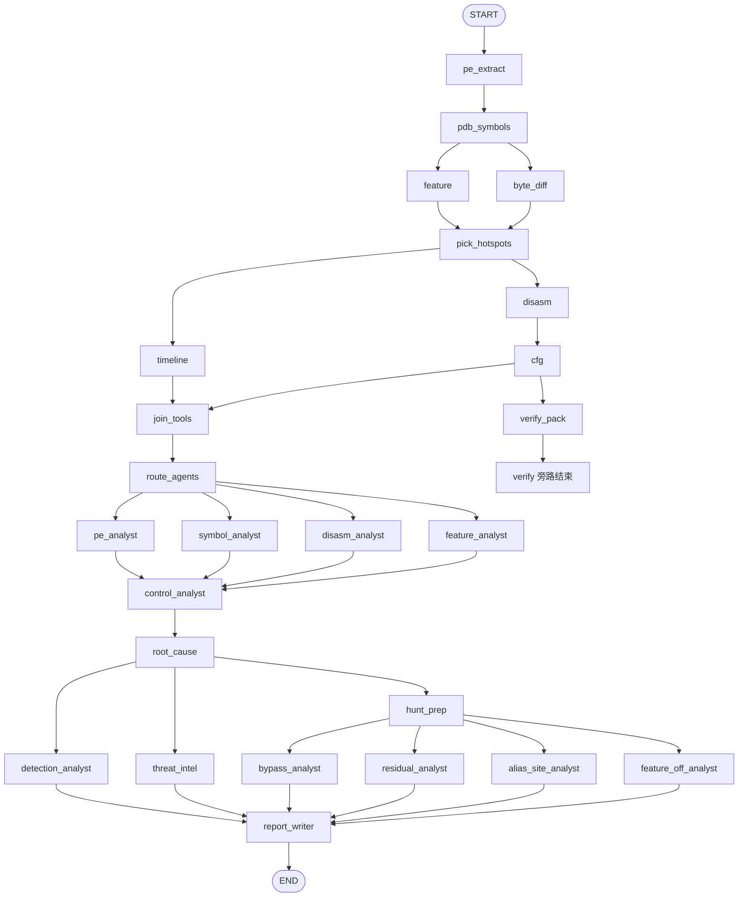

# Patchalyzer.ai 技术流程、逻辑流程与架构

对照当前实现（`webapp/`，2026-08-25）。图结构以 `backend/agents/graph.py` 为准；节点以 `backend/agents/nodes.py` 为准；调度以 `backend/services/pipeline.py` 的 `route_agents` 为准。

---

## 1. 产品定位

Patchalyzer 对比 **漏洞版 / 修复版** Windows 内核组件（`.sys` / `.dll` / `.exe`），用确定性工具采集证据，再用一组固定人设的 LLM 专家解读，产出 **19 节中文技术报告**。

服务对象是补丁负责人、防御方与安全运营，**不是** exploit 开发。

硬约束：

- 不在 UI、提示词、Bypass / HuntLab 中给出 exploit / PoC / 逐步绕过配方。
- RVA、指令、Feature ID、哈希必须来自工具证据，禁止编造。
- 专家目录固定为 **13 人**（外加确定性节点 HuntPrep）。自动编制只决定「本轮跑哪些」，不发明新人格。
- GEPA 提示词优化在分析图外离线运行，不进在线流水线。
- HuntLab 深度狩猎是任务完成后的独立页签，不并进 19 节正文。

默认入口：`python run.py` → `http://127.0.0.1:8765`（`PATCHALYZER_HOST` / `PATCHALYZER_PORT`，`reload=False`）。环境变量前缀 `PATCHALYZER_`。

---

## 2. 架构总览

### 2.1 分层

```
浏览器  frontend/  （FILE / PATCH / HISTORY 三页签）
    │  上传样本或只填 CVE
    │  浏览补丁日 → 点进某月 CVE 列表
    │  轮询 GET /api/jobs/{id}
    ▼
FastAPI  backend/main.py
    │  后台 asyncio 任务 _run_job
    │  可选：CVE → MSRC + Winbindex 成对下载
    │  PATCH：补丁日目录 / 月度 CVE / 监控循环
    ▼
LangGraph  backend/agents/graph.py
    ├─ 工具阶段（确定性，可并行）
    ├─ route_agents（纯规则编制）
    └─ 13 个 LLM 专家 + HuntPrep（图结构固定，节点内可跳过）
    ▼
finalize_soc()  注入 IOC / 情报 / 绕过面 / 残留包，写磁盘
    ▼
SQLite 任务行 + data/jobs/{job_id}/ 产物
```

| 层 | 路径 | 职责 |
|---|---|---|
| HTTP / 任务 | `backend/main.py` | 建任务、跑图、取消/断点、下载、重跑热点/报告、PATCH、HuntLab |
| 图编排 | `backend/agents/graph.py` | 边、流式进度、产物打包、`finalize_soc` |
| 节点 | `backend/agents/nodes.py` | 每个 tool / agent 的输入输出 |
| 状态 | `backend/agents/state.py` | `PatchState`；`traces` 用 `operator.add` 拼接 |
| LLM | `backend/agents/llm.py` | ChatOpenAI（OpenAI 兼容）；提示词来自设置或 `config.py` |
| 调度 / 热点 | `backend/services/pipeline.py` | `route_agents`、`plan_hotspots`、`assess_quality`、checkpoint / 取消 |
| 专家工具箱 | `backend/services/agent_tools.py` | 白名单工具 + 有界 tool loop；流水线与 HuntLab 共用 |
| 确定性分析 | `backend/services/analyzer.py` | PE / PDB / `.pdata` / 反汇编 / CFG / Feature |
| 狩猎简报 | `backend/services/vuln_hunt.py` | HuntPrep：未改兄弟、调用克隆、CFG 缺口、检查-使用窗口 |
| 补丁解析 | `backend/services/patch_resolver.py` | CVE → 成对样本；补丁日列表落盘缓存 |
| 补丁监控 | `backend/services/patch_watch.py` | 每 3 小时看新公告；可选自动排队内核 CVE |
| IOC | `backend/services/ioc.py` | 哈希、hunt 结构；覆盖报告 §16 |
| 威胁情报 | `backend/services/threat_intel.py` | 联网检索 + KEV / NVD / EPSS；覆盖 §17 |
| 补丁评审 | `backend/services/patch_review.py` | Bypass / Residual JSON 包；覆盖 §18 / §19 |
| 函数逻辑图 | `backend/services/func_logic.py` | 从热点与调用差生成 mermaid，注入报告 §6 |
| HuntLab | `backend/services/hunt_lab.py` | 图外深度狩猎，写 `hunt_lab.md` |
| GEPA | `backend/services/gepa_optimize.py` | 离线回放已完成任务优化提示词 |
| 配置 | `backend/config.py` | 19 节模板、13 份专家 system prompt |
| 前端 | `frontend/js/app.js` | 编制开关、流水线、页签、Markdown |

分析核心复用仓库根目录 `analysis/`（PDB 解析）与 `TOOLs/`（pefile / capstone）。

### 2.2 目录与运行时数据

```
webapp/
  run.py                         # uvicorn，reload=False
  requirements.txt
  backend/
    main.py
    config.py
    database.py                  # SQLite：jobs + llm_config + app_kv(watch)
    agents/                      # graph / nodes / state / llm
    services/                    # 工具、解析、狩猎、情报
  frontend/                      # 静态页 index.html + js/css
  data/
    patchalyzer.db
    pdb_cache/                   # 按 PDB GUID 缓存
    cache/msrc/                  # 补丁日 / 月度 CVE / CVRF 落盘
    jobs/{job_id}/               # 单次任务工作目录
  docs/
```

单次任务目录典型产物：

| 文件 | 来源 |
|---|---|
| `old_vulnerable.sys` / `new_patched.sys` | 上传或 Winbindex 下载 |
| `resolve.json` / `ingest.json` | CVE 解析 / 无样本入库 |
| `symbol_diff.json`、`feature_trace.json`、`byte_diff.json` | 工具节点 |
| `disasm/`、`cfg_diff.html`、`hotspots.json` | 反汇编 / CFG |
| `hunt_brief.json` | HuntPrep |
| `checkpoints/{node}.json` | 每节点断点，供「从断点继续」 |
| `routing.json` | 自动/手动编制 |
| `report.md`、`ioc.json`、`threat_intel.json` | 收尾写入 |
| `verify/` | 隔离 VM 核对材料（服务器不跑 PoC） |
| `hunt_lab.md` | 可选深度狩猎 |

环境变量：

| 变量 | 默认 | 说明 |
|---|---|---|
| `PATCHALYZER_HOST` | `127.0.0.1` | 监听地址 |
| `PATCHALYZER_PORT` | `8765` | 端口 |
| `PATCHALYZER_MAX_UPLOAD_MB` | `200` | 单文件上限 |

LLM 配置（provider / base_url / api_key / model / 各专家 prompt）存在 SQLite `llm_config`，不进 git。

### 2.3 三张图

| 函数 | 用途 |
|---|---|
| `build_graph()` | 完整分析：工具 + 编制 + 专家 |
| `build_tail_graph()` | 「加选热点并重跑尾部」：从 `pick_hotspots` 起 |
| `build_llm_graph()` | 「重跑报告」：只跑编制 + 专家，不再下 PDB / 反汇编 |

每个节点包在 `guarded()` 里：检查取消、报进度、按 checkpoint 跳过、写 checkpoint。

---

## 3. 逻辑流程：一次分析怎么走完

### 3.1 入口（三种）

**FILE 页签** `POST /api/jobs`：

| 字段 | 必填 | 说明 |
|---|---|---|
| `cve` | 无样本时必填 | 例 `CVE-2026-50472` |
| `old_file` | 否 | 漏洞版；不传则按 CVE 成对下载 |
| `new_file` | 否 | 修复版；不传则按 CVE + 已有漏洞版拉修复构建 |
| `filename` | 否 | 组件名提示，如 `afd.sys` / `luafv.sys` |
| `mid_file` | 否 | 更早构建，三版本尺寸时间线 |
| `run_llm` | 默认 true | false 时只跑工具，专家写「跳过」 |
| `enabled_agents` | 否 | 勾选上限；空且显式全不选 = 关 LLM |
| `routing_mode` | `auto` / `manual` | 自动编制会按证据裁专家；手动按勾选全跑 |

校验：既无样本也无 CVE → 400。无漏洞样本时必须有 CVE。

**PATCH 页签** `POST /api/jobs/from-cve`：从某期公告点「分析」，不上传文件。

**监控** `patch_watch`：新补丁日出现且打开「自动分析」时，最多排队 6 个内核向 CVE（首次打开监控不会把当月全部倒进去）。

### 3.2 `_run_job` 生命周期

1. `status=running`，进度进内存 `JOB_PROGRESS`。
2. **无漏洞样本**：`resolve_pair_from_cve` → 写 `old_vulnerable.sys` / `new_patched.sys`（Winbindex 同分支 N vs N-1，优先 amd64）。
3. **有漏洞样本、无修复版**：`resolve_patched_binary` 按 CVE/KB 拉更高版本。
4. `invoke_analysis_graph(...)` 跑 LangGraph。
5. `finalize_soc` 补齐 IOC / 情报 / 绕过 / 残留，消毒猜测项，写 `report.md` 等。
6. 成功 `completed`；取消 `cancelled`；异常 `failed`（`error` 为人读文本）。

前端轮询 `GET /api/jobs/{id}`。失败或报告为空的已完成任务可 `POST .../resume` 从 checkpoint 续跑。

样本解析诚实边界：不能从 Update Catalog 解 MSU/CAB；文件名从 MSRC 标题推断（可手填）；Winbindex 可能落后于 Patch Tuesday。

### 3.3 主图（当前边）

工具阶段有并行；专家阶段有两处扇出汇合。



设计意图：

- Feature 与字节差在热点选择之前并行，xref 能进热点名单。
- 时间线与反汇编在热点确定后并行；CFG 依赖反汇编。
- `verify_pack` 从 CFG 旁路到 END，不挡专家；`join_tools` 等时间线+CFG 齐了再编制。
- 四专家并行 → 对照路径汇合 → 根因。
- 根因后：SOC（检测/情报）与 HuntPrep 并行；HuntPrep 后再并行 Bypass / Residual / Alias / FeatureOff。
- ReportWriter 吃齐六路再执笔（图上六条入边；实现上 LangGraph 可能在子集就绪时先触发一次，续跑/重跑以 checkpoint 为准）。

未勾选 LLM 或未配 Key：工具照跑；`_safe_agent` 写「跳过」，图不中断。某个专家 LLM 失败：该节点记 `llm_error`，图仍前进。

---

## 4. 技术流程：工具阶段

证据优先级（全局）：

**`.pdata` 函数尺寸 > 反汇编 / 调用差 > Feature xref > 字节差（含 RIP 重定位噪声）**

热点 `plan_hotspots`：先 `functions_resized`，再字节差 top，再 Feature xref，最多约 16 个。对照：Notify / Cleanup / Lock 等软提示 + 同前缀且尺寸未变的兄弟，最多约 24 个。

| 节点 | 界面名 | 做什么 | 主要产物 |
|---|---|---|---|
| `pe_extract` | PEExtractor | 节区、导入、FileVersion、架构、哈希、PDB GUID | `old_pe` / `new_pe` |
| `pdb_symbols` | SymbolDiffer | 符号服务器下 PDB，公开符号增删、`.pdata` 尺寸 | `symbol_diff.json` |
| `feature` | FeatureTracer | 新增 `Feature_*` xref、on-disk dword、IsEnabled | `feature_trace.json` |
| `byte_diff` | ByteDiffer | 代码节字节差（辅证） | `byte_diff.json` |
| `pick_hotspots` | （内部） | 选定热点与对照名单 | `hotspot_plan` |
| `timeline` | SizeTimeline | 更早/漏洞/修复三列尺寸 | `size_timeline.json` |
| `disasm` | DisasmWorker | Capstone 全文；`calls_added` / `calls_removed` | `disasm/*.asm` |
| `cfg` | CfgDiffer | 热点基本块 diff | `cfg_diff.html` |
| `verify_pack` | VerifyPack | 打包隔离 VM 核对材料，**服务器不跑 verifier** | `verify/` |
| `join_tools` | （内部） | 时间线与 CFG 汇合门闩 | — |
| `route_agents` | AgentRouter | 按证据裁专家名单，写 `routing.json` | `routed_agents` |

`verify.zip` 供分析师在快照 VM 里自行核对，不含 exploit。

---

## 5. 技术流程：编制与专家

### 5.1 自动编制 `route_agents`

勾选是**上限**，不是「必须全跑」。`auto` 模式下：

- 核心始终尝试：PE / Symbol / Disasm / RootCause，以及 ReportWriter、DetectionAnalyst。
- 有 Feature xref 才跑 FeatureAnalyst、FeatureOffAnalyst。
- 有对照函数才跑 ControlPathAnalyst。
- 标题/元数据有 CVE 才跑 ThreatIntelAnalyst。
- Bypass / Residual / Alias 默认纳入（仍受勾选上限约束）。

`manual`：勾选的全部跑。未启用 LLM：全部跳过。

### 5.2 13 名专家

每个专家走 `run_specialist`：拼 system prompt → 可选调用白名单工具 → 写笔记。工具轮次用尽仍无正文时，会再强制一轮「只写正文」（避免「未返回文本」）。

| 节点 | Agent | 写出 | 职责 |
|---|---|---|---|
| `pe_analyst` | PEAnalyst | `pe_notes` | 同架构？同分支小版本还是跨大版本 |
| `symbol_analyst` | SymbolAnalyst | `symbol_notes` | 热点与「补丁落在哪一跳」 |
| `disasm_analyst` | DisasmAnalyst | `disasm_notes` | 锁 / Feature / 池 / 读写 vs 释放路径 |
| `feature_analyst` | FeatureAnalyst | `feature_notes` | WIL 缓存位与启用位；映像内 0 ≠ 运行时关 |
| `control_analyst` | ControlPathAnalyst | `control_notes` | 尺寸未变的对照路径排除为本次修复点 |
| `root_cause` | RootCauseAnalyst | `root_cause` | 综合根因 +「漏洞链草稿」（真实函数名 CALL 链） |
| `hunt_prep` | HuntPrep（工具） | `hunt_brief` | 未改兄弟反汇编、克隆调用、CFG 缺口、skip window |
| `detection_analyst` | DetectionAnalyst | `detection_notes` | SOC 检测方法；哈希禁止编造 |
| `threat_intel` | ThreatIntelAnalyst | `threat_notes` | 检索 APT/组织；空则对照 KEV/NVD/EPSS |
| `bypass_analyst` | BypassAnalyst | `bypass_pack` | 补丁完整性：Feature 关闭、部分调用点、检查-使用窗口 |
| `residual_analyst` | ResidualVulnAnalyst | `residual_pack` | 未改兄弟是否仍缺同类检查 |
| `alias_site_analyst` | AliasSiteAnalyst | `alias_pack` | 补丁是否只打在部分 CALL 点 |
| `feature_off_analyst` | FeatureOffAnalyst | `feature_off_pack` | Feature 关闭是否回到旧逻辑 |
| `report_writer` | ReportWriter | `report` | 按 19 节执笔；§16–19 表格由系统覆盖 |

Canonical ID（勾选/编制/GEPA 必须用这些字符串）：

`PEAnalyst`, `SymbolAnalyst`, `DisasmAnalyst`, `FeatureAnalyst`, `ControlPathAnalyst`, `RootCauseAnalyst`, `DetectionAnalyst`, `ThreatIntelAnalyst`, `BypassAnalyst`, `FeatureOffAnalyst`, `ResidualVulnAnalyst`, `AliasSiteAnalyst`, `ReportWriter`。

### 5.3 白名单工具（专家与 HuntLab 共用）

`pe_info`, `list_symbols`, `function_meta`, `disasm`, `cfg_blocks`, `call_neighbors`, `patched_pattern`, `feature_info`, `read_evidence`, `compare_calls`。

每专家有轮次/调用/反汇编预算。未知工具名拒绝。禁止 shell、payload、exploit。并行专家各自沙箱 + 二进制锁。

### 5.4 收尾 `finalize_soc`

- 从笔记解析 / 合并 Bypass 与 Residual 包，降级「只凭函数名猜测」的残留项。
- 注入 §16 IOC、§17 情报、§18 绕过、§19 残留。
- 用调用差覆盖报告里的函数逻辑 mermaid。
- 评估 `evidence_quality`（无 PDB、热点覆盖不足等）。

---

## 6. 报告结构（19 节）

ReportWriter 必须按下列一级标题输出，编号与文字不可改。§16–19 正文短导语，表格由系统写入。

| 节 | 标题 | 主要内容来源 |
|---|---|---|
| 1 | 执行摘要 | 决策层一页：版本、根因一句话、攻击面 |
| 2 | 分析方法论 | 样本、PDB、热点规则 |
| 3 | CVE/MSRC 描述对照 | 公告类型 vs diff |
| 4 | 漏洞根因 | 缺陷机制，不是完整攻击链 |
| 5 | 竞态/同步时序 | 锁域、窗口 |
| 6 | 漏洞链 | **核心交付物**：总览表 + 函数 CALL 图 + 原语/影响 + 切断点 |
| 7 | 汇编证据 | 热点指令 |
| 8 | 伪代码对比 | 旧/新逻辑 |
| 9 | 状态机/标志位 | Feature / 对象标志 |
| 10 | Feature 开关 | xref 与门控 |
| 11 | 用户态触发面 | 交叉引用 §6 |
| 12 | 利用难度与影响 | 概念级，无 PoC |
| 13 | 对照路径排除 | ControlPath |
| 14 | 修复有效性与残余风险 | 与 §18/§19 交叉引用 |
| 15 | 附录 | 时间线、文件列表 |
| 16 | IOC / 检测方法 | Detection + `ioc_pack` |
| 17 | 在野利用 / 威胁情报 | 检索优先，目录对照 |
| 18 | 补丁完整性 / 绕过面 | Bypass + FeatureOff |
| 19 | 残留漏洞 / 同类缺陷 | Residual + AliasSite |

---

## 7. PATCH 子系统

前端只有两级：**补丁日列表** → **某月 CVE 列表**。

| API | 行为 |
|---|---|
| `GET /api/patch-tuesday` | 补丁日目录（`list_patch_days`） |
| `GET /api/patch-tuesday?bulletin=2026-Aug` | 该期 Windows CVE |
| 上述加 `?refresh=1` | 强制向 MSRC 重拉 |
| `POST /api/patch-tuesday` | 「分析本期内核 CVE」（`force` 入库） |
| `GET/PUT /api/config/watch` | 监控开关、是否自动分析 |

落盘（`data/cache/msrc/`）：

- `months.json` / `days.json`：MSRC updates 与渲染后的补丁日
- `cvrf-{id}.json`：原始月度 CVRF
- `inbox-{id}.json`：过滤后的 CVE 行（跳过 Edge/Office 等）

打开 PATCH 或点进某月默认读缓存；点「刷新」才打 MSRC。后台 `watch_tick` 每 3 小时带 `refresh=True` 探新公告。前端另有内存缓存，切页签不再请求。

成对下载局限：同分支 N vs N-1，优先 amd64；文件名靠标题猜测。

---

## 8. 图外能力

| 能力 | 触发 | 说明 |
|---|---|---|
| 取消 | `POST /jobs/{id}/cancel` | 节点间隙抛 `PipelineCancelled` |
| 从断点继续 | `POST /jobs/{id}/resume` | 读 `checkpoints/`；报告为空的 completed 也可续 |
| 重试 PDB | `POST /jobs/{id}/retry-pdb` | 强制重跑符号及相关下游 |
| 加选热点 | `POST /jobs/{id}/hotspots` | `build_tail_graph` |
| 重跑报告 | `POST /jobs/{id}/report` | `build_llm_graph` |
| HuntLab | `POST /jobs/{id}/hunt-lab` | 绕过面 / 同类变体两轨，工具循环后写 `hunt_lab.md` |
| GEPA | `POST /api/config/llm/gepa` | 用历史任务离线进化**当前选中分析师**的 prompt |

---

## 9. 前端结构

三页签：

- **FILE**：可选上传漏洞样本、CVE、文件名、Agent 勾选、自动/手动编制。
- **PATCH**：补丁日 → CVE 列表；监控与「分析本期内核 CVE」。
- **HISTORY**：任务列表。

任务弹层：流水线（点节点看阶段输出）、摘要、符号/时间线/反汇编/CFG、IOC、在野、绕过、残留、HuntLab、报告导出（PDF / HTML / Markdown，可勾选章节）。

流水线图例：Tool / Agent；完成 / 进行中 / 跳过 / 失败。

---

## 10. 数据流（一句话）

**CVE 或样本 → 成对 PE → PDB 与尺寸/Feature/字节差 → 热点反汇编与 CFG → 规则编制 → 并行专家笔记 → 根因与狩猎简报 → SOC + 完整性/残留四路 → ReportWriter 19 节 → 系统注入 IOC/情报/评审表 → 落盘与前端页签。**

---

## 11. 实现上需要知道的点

- **uvicorn `reload=False`**：改后端必须重启 `python run.py`；强杀旧进程退出码 `4294967295` 是预期现象。
- **ReportWriter 空正文**：历史上出现过模型只调工具不写字；当前 tool loop 结束后会强制再写一轮，仍空则报 `未返回文本`。
- **报告为空仍显示 completed**：收尾成功但执笔失败时，流水线会显示 `llm_error`，可「从断点继续」只重跑 ReportWriter。
- **不从 Update Catalog 解包**：没有 MSU/CAB 提取；Winbindex 滞后则成对下载失败，需手传样本。
- **HuntLab ≠ HuntPrep**：HuntPrep 在图内、进 §18/§19 证据；HuntLab 在图外、单独 md。
